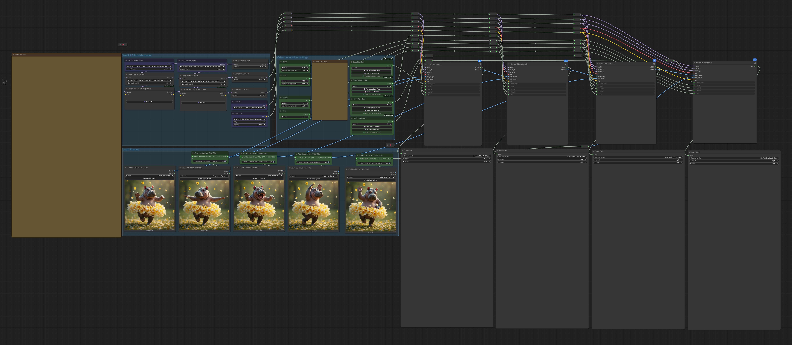

# Wan2.2 FFLF video WF - ComfyUI Workflow

## 📖 Description

This ComfyUI workflow leverages the WAN 2.2 model to generate extended video sequences through a multi-stage image-to-video approach. 
The workflow is designed to produce four consecutive video takes that can be seamlessly combined into a single 20-32 second final output.

## Features

- 4-Stage Sequential Generation: Creates four separate video takes (Take 1-4), each approximately 5-8 seconds in duration
- First & Last Frame Control: Each take supports optional first-frame and last-frame conditioning, allowing precise control over the beginning and end of each segment
- Image-to-Video Pipeline: Utilizes WAN 2.2's i2v capabilities with customizable positive and negative prompts for each take

## Examples

## Requirements

**Models:**
- [Model 1] - [link]
- [Model 2] - [link]

**Custom Nodes:**
- [Node 1] - [link]
- [Node 2] - [link]

**System:** [X]GB VRAM minimum

## Installation

1. Download the workflow JSON file
2. Install required custom nodes via ComfyUI Manager
3. Download required models and place in ComfyUI folders
4. Load the JSON in ComfyUI

## Usage

[2-3 punti chiave su come usarlo]

**Recommended Settings:**
- Steps: [X]
- CFG: [X]
- Sampler: [X]

## Support

- **Issues:** Open an issue on this repository
- **X:** [@tenofaz](https://x.com/tenofaz)
- **Website:** [tenofas.ai](https://tenofas.ai)

---

*Part of the [Tenofas Workflows](https://github.com/Tenofas) collection*
